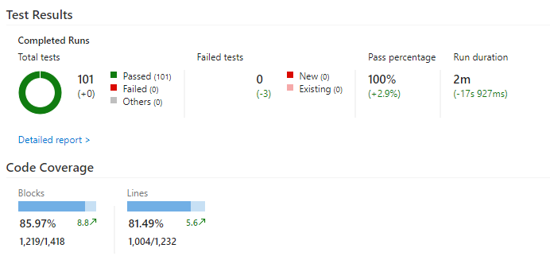

# Overwatch League Chatbot [](https://ci.appveyor.com/project/lfmundim/owleaguechatbot)

## Developed by:
* [Guilherme Vieira](https://github.com/guixvieira)
* [Lucas Mundim](https://www.github.com/lfmundim)
* [Pedro Nascimento](https://github.com/PedroPrisxzma)

as part of a class assignment.

## Index
1. [To-Do List](#to-do-list)
1. [Continuous Integration and Code Coverage](#continuous-integration-and-code-coverage)
1. [Architecture](#architecture)
1. [BLiP Overview](#blip-overview)
    1. [Scheduler](#scheduler)
    1. [Broadcast](#broadcast)
    1. [Bucket](#bucket)
    1. [Contact](#contact)
    1. [Artificial Intelligence](#artificial-intelligence)
    1. [Event Analysis](#event-analysis)

## To-Do List
1. Logs, logs everywhere
1. Hosting
1. Usage of NLP

_Any feature request is appreciated and will be considered dearly! Pull Requests are also encouraged!_

## Continuous Integration and Code Coverage
To develop this project we used Microsoft's *Visual Studio*, which we integrated with [VSTS](https://www.visualstudio.com/pt-br/team-services/). The usefulness in that is the possibility of automatically running our implemented Unit Tests (we use *NUnit* for those) and showing us, graphically, how many (and which) tests the code is failing, as well as a percentage of *Code Coverage*. Those actions are run automatically whenever we publish on the [public repo](https://github.com/lfmundim/OWLeagueChatbot), which will be mirrored to the closed repo for the duration of the assignment.

We are also using CI with [AppVeyor](https://ci.appveyor.com/project/lfmundim/owleaguechatbot) to produce the Build Badge that is along with the title to show graphically in this documentation if the current build is passing on all tests or not. It's possible to check directly on that link if any and which test is failing.



☝*VSTS Test Results*

---

## Architecture:
* Developed using `.NET Core 2.0` (and [BLiP's SDK](https://docs.blip.ai/#c))
* Integration with Blizzard's *Overwatch League* [API](api.overwatchleague.com) - methods scrubbed by [this reddit post](https://www.reddit.com/r/Competitiveoverwatch/comments/7p0e8d/owl_api_analysis/)
* Channel Integration using [BLiP](preview.blip.ai)
* Dependency injection using `Simple Injector`, including Singleton registry

---

## BLiP Overview
BLiP's own extensions (such as `ISender` and `ISchedulerExtension`) basically send `HTTP Requests` to `IRIS`, BLiP's host. It acts like a `gateway` to route messages to wherever they are sent to, or commands for that matter (ex: IBM's *Watson* integration).

### Scheduler
Example HTTP Request
```http
POST https://msging.net/commands HTTP/1.1
Content-Type: application/json
Authorization: Key {YOUR_TOKEN}

{  
  "id": "1",
  "to": "postmaster@scheduler.msging.net",
  "method": "set",
  "uri": "/schedules",
  "type": "application/vnd.iris.schedule+http",
  "resource": {  
    "message": {  
      "id": "ad19adf8-f5ec-4fff-8aeb-2e7ebe9f7a67",
      "to": "destination@0mn.io",
      "type": "text/plain",
      "content": "Scheduling test"
    },
    "when": "2016-07-25T17:50:00.000Z"
  }
}
```
This extension adds any [LIME](https://docs.blip.ai/?http#content-types) type message to be sent to any recipient (even Broadcast lists, which is the use on this particular Chatbot) on a set date and time.

### Broadcast
Example HTTP Request
```http
POST https://msging.net/commands HTTP/1.1
Content-Type: application/json
Authorization: Key {YOUR_TOKEN}

{  
  "id": "2",
  "to": "postmaster@broadcast.msging.net",
  "method": "set",
  "uri": "/lists/your_distributionList@broadcast.msging.net/recipients",
  "type": "application/vnd.lime.identity",
  "resource": "551100001111@0mn.io"
}
```
This extension manages broadcast lists, including creating, adding and removing contacts from it. The sole purpose of Broadcast Lists on this chatbot is to send general notifications the user subscribed for.

### Bucket
Example HTTP Request
```http
POST https://msging.net/commands HTTP/1.1
Content-Type: application/json

{  
  "id": "1",
  "method": "set",
  "uri": "/buckets/xyz1234",
  "type": "application/json",
  "resource": {  
    "key1": "value1",
    "key2": 2,
    "key3": [  
      "3a", "3b", "3c"
    ]
  }
}
```
This extension, hidden behind our own `IContextManager` service, serves as a connection between the service and IRIS's database, dubbed `bucket`. In it we store `.json`-like objects representing pertinent user information that must not be lost.

### Contact
Example HTTP Request
```http
POST https://msging.net/commands HTTP/1.1
Content-Type: application/json
Authorization: Key {YOUR_TOKEN}

{  
  "id": "1",
  "method": "set",
  "uri": "/contacts",
  "type": "application/vnd.lime.contact+http",
  "resource": {
    "identity": "11121023102013021@messenger.gw.msging.net",
    "name": "John Doe",
    "gender":"male",
    "group":"friends",    
    "extras": {
      "plan":"Gold",
      "code":"1111"      
    }
  }
}
```
This extension allows the storage of user information obtained by the channel. By using Facebook's *Messenger* we get a lot of information right off the start and parse it into the *Contact* extension to be used at any time (ex: get the user name without having to ask for it).

### Artificial Intelligence
Example HTTP Request
```http
POST https://msging.net/commands HTTP/1.1
Content-Type: application/json
Authorization: Key {YOUR_TOKEN}

{
  "id": "9",
  "to": "postmaster@ai.msging.net",
  "method": "set",
  "uri": "/analysis",
  "type": "application/vnd.iris.ai.analysis-request+json",
  "resource": {
    "text":"I want a pepperoni pizza"
  }
}
```
This extension is used to send queries to either Microsoft's Luis or IBM's Watson (we use the latter in our project). Regarding Watson, it will be treated by the (former) *Conversation* service and the response will have an array of all the *intentions* and *entities* we created. The creation of AI intentions/entities, as well as training and publishing the model *can* be done by issuing HTTP requests, but it is much simpler to simply use the GUI provided at [BLiP's Website](https://preview.blip.ai).

### Event Analysis
Example HTTP Request
```http
POST https://msging.net/commands HTTP/1.1
Content-Type: application/json
Authorization: Key {YOUR_TOKEN}

{
  "id": "9494447a-2581-4597-be6a-a5dff33af156",
  "to": "postmaster@analytics.msging.net",
  "method": "set",
  "type": "application/vnd.iris.eventTrack+json",
  "uri": "/event-track",
  "resource": {
    "category": "payments",
    "action": "success-order"
  }
}
```
This extension allows the programmer to track any event that happened within the application. The *category* property indicates the general category of what you are willing to track and the *action* property indicates the actual event that happened regarding that category. Ex: Issued an API call (category), it returned `Status Code = 200` (action). You can materialize those stats on one of many charts available at [BLiP's Website](https://preview.blip.ai).
